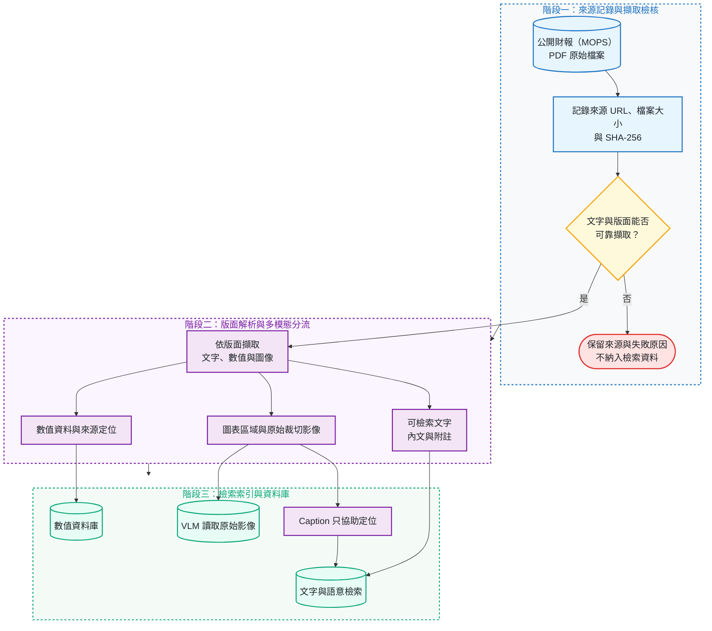
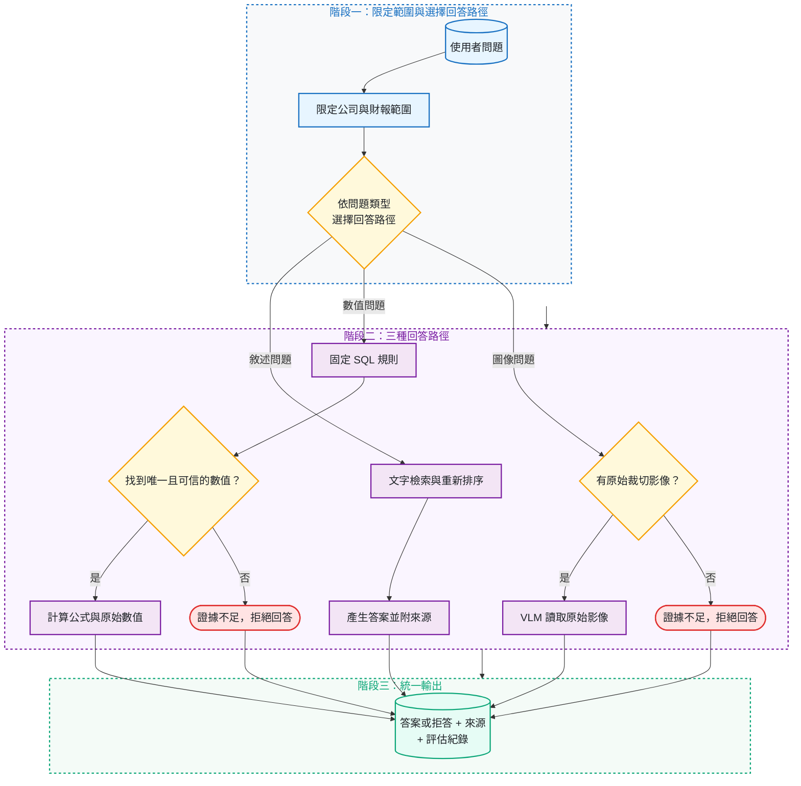

# TW Filing Intelligence

[](https://github.com/kuotunyu/tw-filing-intelligence/actions/workflows/ci.yml)
[](https://github.com/kuotunyu/tw-filing-intelligence/releases/latest)


[](LICENSE)

> **最新版本：v1.0.5 · Frozen Protocol：v1.0.0**

這是一個臺灣公開財報 multimodal RAG / VLM 的事前註冊可行性研究：固定資料、模型、門檻與評分規則後，加入更多檢索、數值與視覺能力，是否真的能勝過簡單的文字 RAG？

本專案是 **research prototype**，**不是 production 系統**、filing assistant，也**不是投資建議**。它的重點不是展示成功產品，而是保存一個可追溯、可重算的客觀負結果。

---

## 核心結論與研究摘要

LOCKED 是事前封存、只執行一次的正式評估，共 33 題。F0 與 F7 是實驗系統編號：F0 是 baseline，F7 是 preregistered full candidate。

| 比較對象 | 系統實作架構 | LOCKED 答對題數（共 33 題） |
|---|---|---:|
| 簡單文字檢索系統（F0） | PDF 文字擷取、BM25、共用答案生成 | recorded **17/33**；protocol-literal **18/33** |
| 完整候選系統（F7） | 版面解析、hybrid retrieval、reranking、數值回答路徑、圖像證據、typed routing | recorded／protocol-literal **6/33** |

原始 runtime 將文字題只用 exact match 判分，因此 locked artifact 保留 recorded 17/33；
post-hoc audit 依 Protocol 的 `exact match OR token-F1 >= 0.8` 重算為 18/33。Candidate
仍是 6/33，frozen [`NO_GO`](docs/FEASIBILITY_REPORT.md) 不變。詳見
[`Locked Analysis Audit`](docs/ANALYSIS_AUDIT.md)。
簡記：baseline 是 recorded 17/33、protocol-literal 18/33；candidate 兩種讀法都是 6/33。

### 為什麼判定為 NO-GO？

1. **數值回答失敗**：數值回答路徑處理的 12 題中，答對 **0 題**。
2. **問題分流不可靠**：33 題中只有 **11 題**選對回答路徑。
3. **引用證據不足**：完整候選系統產生的 17 個引用中，只有 **9 個**有效。

LOCKED 只有 33 題，圖表題更只有 2 題。所有比例都必須連同分子、分母與信賴區間閱讀，不能視為正式產品的可靠度。

---

## 系統架構與流程

### 1. 財報解析與多模態證據鏈建置

每份財報先記錄官方 URL、檔案大小與 SHA-256，再確認文字與版面能否可靠擷取。可用文件拆解為文字、結構化數值與原始圖表影像：



### 2. 完整候選系統的回答流程（F7）

系統先限定公司與財報範圍，再依固定規則選擇一次回答路徑；它不是會循環規劃的 Agent。任何路徑缺少可信證據時，系統都可以拒絕回答：



---

## 嚴謹評估設計與實驗明細

```text
DEV 設計 → 註冊實驗與通過門檻 → 凍結 Protocol 與證據檔案雜湊 → 唯一 LOCKED run → 保存原始結果 → 離線重算 → NO_GO
```

F0–F7 是事前註冊的 factor ladder，不是產品版本。F1–F6 是 diagnostic ablation；只有 F0 是 baseline、F7 是 preregistered full candidate。下表保留原始 recorded run；protocol-literal audit 只調整 F0=18、F1=16、F2=16，其餘不變。

| 實驗編號 | LOCKED 準確率 | 逐步加入的能力 |
|---|---:|---|
| F0 | 51.5%（17/33） | baseline：PDF text + BM25 |
| F1 | 45.5%（15/33） | 版面解析與 chunking |
| F2 | 42.4%（14/33） | hybrid retrieval |
| F3 | 57.6%（19/33） | cross-encoder reranking |
| F4 | 57.6%（19/33） | structured numeric route |
| F5 | 60.6%（20/33） | 圖表區域 Caption 語意索引 |
| F6 | 54.5%（18/33） | original crop evidence / crop VLM |
| F7 | 18.2%（6/33） | typed dispatch；preregistered full candidate |

---

## 證據與離線重現

| 核心主張 | 已提交證據 | 離線重算 |
|---|---|---|
| Protocol 未漂移 | [`protocol_lock.json`](results/feasibility/protocol_lock.json) | `test_real_protocol_lock_still_holds` |
| 簡單系統（F0）recorded 17/33、protocol-literal 18/33 | [`F0/records.jsonl`](results/runs/F0/records.jsonl) | `scripts/verify_results.py --dry-run` + `scripts/verify_analysis_audit.py` |
| 完整系統（F7）6/33 | [`F7/records.jsonl`](results/runs/F7/records.jsonl) | `scripts/verify_results.py --dry-run` |
| 判定 NO_GO | [`GO_NO_GO.json`](results/feasibility/GO_NO_GO.json) | `scripts/verify_evidence.py` |
| Post-hoc scorer deviation 與 secondary metrics | [`analysis_audit.json`](results/feasibility/analysis_audit.json) | `scripts/verify_analysis_audit.py` |
| DEV / LOCKED 無洩漏 | [`dev`](data/evaluation/dev/gold.jsonl) 與 [`locked`](data/evaluation/locked/gold.jsonl) | `scripts/check_leakage.py` |

### 快速開始與離線驗證

環境需求：Python 3.13、`uv`。下列 evidence verification 不呼叫模型／API／GPU；首次
`uv sync` 若本機沒有套件 cache，仍需連線至 package registry 安裝相依套件：

```bash
# 建立環境並安裝相依套件
uv sync --extra dev --frozen

# 執行測試與靜態稽核
uv run pytest
uv run ruff check .
uv run ruff format --check .
uv run mypy src scripts

# 執行結果驗證與資料洩漏檢查
uv run python scripts/verify_results.py --dry-run
uv run python scripts/verify_evidence.py
uv run python scripts/verify_analysis_audit.py
uv run python scripts/check_leakage.py
```

---

## 核心文檔導覽

- [Feasibility Final Report](docs/FEASIBILITY_REPORT.md)：完整 Locked 結果、G1–G10 門檻通過狀態與限制。
- [Locked Analysis Audit](docs/ANALYSIS_AUDIT.md)：scorer deviation、secondary metrics、統計與重現層級。
- [Protocol 1.0.0](docs/FEASIBILITY_PROTOCOL.md)：事前註冊之實驗協定與凍結規範。
- [Data Provenance](docs/DATA_PROVENANCE.md)：公開財報來源、SHA-256 雜湊與排除清單。
- [Zenodo Package Plan](docs/ZENODO_PACKAGE.md)：archive 收錄範圍、授權矩陣與驗收指令。
- [Decision Log](docs/DECISIONS.md)：研究決策脈絡與歷史紀錄。

---

## 授權與聲明

原始程式碼採 [MIT License](LICENSE)；作者自有的 documentation、evaluation metadata 與
run／analysis artifacts 採 [CC BY 4.0](CONTENT_LICENSE.md)。公開財報、資料來源與內嵌的
第三方引文不屬於本專案授權。發布或再利用前請先讀 [`NOTICE.md`](NOTICE.md)。
