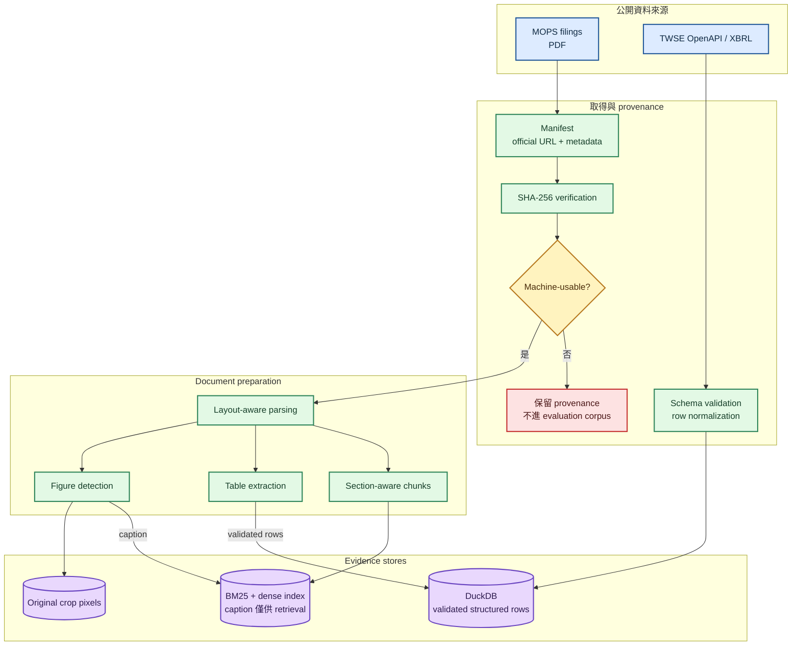
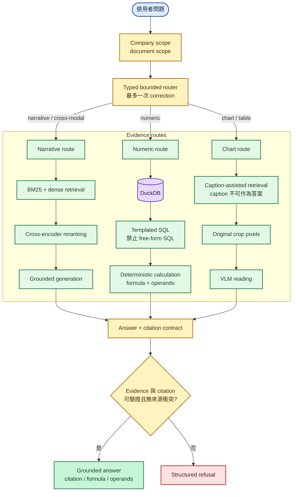
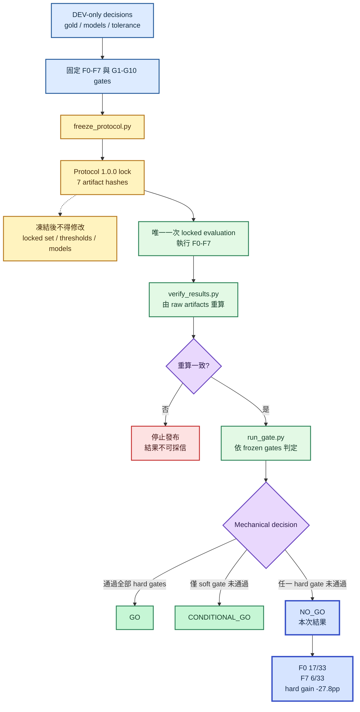

# TW Filing Intelligence

[](https://github.com/kuotunyu/tw-filing-intelligence/actions/workflows/ci.yml)
[](https://github.com/kuotunyu/tw-filing-intelligence/releases/tag/v1.0.0)
[](https://www.python.org/)

針對臺灣上市公司公開財報打造的 multimodal RAG / VLM 可行性研究。專案以事前註冊的 Protocol 1.0.0，驗證 MOPS PDF、TWSE OpenAPI 與 XBRL 能否支撐可追溯、可拒答、可重現的 filing intelligence 系統。

研究已完整結案，唯一一次 locked evaluation 由程式依預先凍結的 gate 判定為 [`NO_GO`](docs/FEASIBILITY_REPORT.md)。候選系統沒有通過；評估機制成功辨識了它。

## 研究規模

| 項目 | 規模 |
|---|---:|
| 公司與產業 | 5 家公司、4 個產業 |
| 文件範圍 | FY2023–FY2024，宣告 10 份、機器可用 8 份 |
| Gold set | 53 筆：DEV 15、LOCKED 33、no-evidence probes 5 |
| Factor ladder | F0–F7，共 8 組受控實驗 |
| 品質驗證 | 1,632 tests、94.27% coverage、strict mypy、Ruff |

兩份不可用文件均為真實資料品質問題：PDF 缺少可用的 ToUnicode mapping。它們被保留在 manifest 與 provenance 中，沒有為了提高結果而替換樣本。

## 系統設計

### Offline data preparation



### Query-time answer flow



- Narrative route：hybrid retrieval、cross-encoder reranking、可定位 citation。
- Numeric route：可靠數值不交給 embedding 猜測；使用 DuckDB、deterministic SQL，並保留 formula 與 operands。
- Chart route：caption 只參與 indexing / retrieval；答案必須回到 crop pixels 或可靠結構化資料。
- Router：typed、bounded，最多一次 correction，沒有無上限 agent loop。
- Refusal：證據不足時拒答，並量測 refusal precision / recall。

## 事前註冊實驗

評分規則、tolerance、GO / NO-GO gates 與七個關鍵 artifact hash 在 locked run 前完成凍結。執行後不改題目、不調門檻、不挑結果。

### Pre-registered evaluation



| Factor | Locked accuracy | 主要變因 |
|---|---:|---|
| F0 | 51.5%（17/33） | baseline |
| F1 | 45.5%（15/33） | layout-aware parsing |
| F2 | 42.4%（14/33） | hybrid retrieval |
| F3 | 57.6%（19/33） | cross-encoder reranking |
| F4 | 57.6%（19/33） | page-neighbor expansion |
| F5 | 60.6%（20/33） | table / chart evidence |
| F6 | 54.5%（18/33） | typed dispatch |
| F7 | 18.2%（6/33） | full candidate |

最終 candidate 相對 baseline 的 hard-category pooled gain 為 **-27.8pp**。G1、G8、G9、G10 通過；G2–G7 未通過，因此結論為 `NO_GO`。

關鍵失敗訊號：

- citation validity：52.9%（9/17）
- numeric route accuracy：0%（0/12）
- route accuracy：33.3%（11/33）
- retrieval p95：0.149 秒
- generation p95：2.957 秒
- peak VRAM：20.09 GB

負面結果不是未完成。這份研究完成了 protocol freeze、資料 provenance、locked evaluation、raw-artifact 重算與機械式 gate decision，並留下下一輪 Protocol 2.x 可直接驗證的 failure decomposition。

## 重現方式

需求：Python 3.13、[uv](https://docs.astral.sh/uv/)。離線測試與資料驗證只使用 CPU；index build 與 generation 才需要 GPU，目標環境為 RTX 4090 24GB。

```bash
uv sync --extra dev
uv run pytest
uv run ruff check .
uv run ruff format --check .
uv run mypy src
```

重新取得公開資料：

```bash
uv run python scripts/fetch_twse_openapi.py --manifest data/manifests/structured.yaml
uv run python scripts/fetch_documents.py --manifest data/manifests/documents.yaml
uv run python scripts/verify_manifests.py
```

Repository 不重新散布原始年報或財報 PDF，只提交 manifest、官方來源 URL、SHA-256 與重建腳本。

## 研究文件

| 文件 | 內容 |
|---|---|
| [最終報告](docs/FEASIBILITY_REPORT.md) | 唯一 locked run、完整指標、限制與 `NO_GO` 判定 |
| [評估協議](docs/FEASIBILITY_PROTOCOL.md) | 事前凍結的 Protocol 1.0.0 與 gates |
| [實作計畫](docs/IMPLEMENTATION_PLAN.md) | phase、交付項目與完成條件 |
| [資料 provenance](docs/DATA_PROVENANCE.md) | 官方來源、取得方式、授權與 SHA-256 |
| [決策紀錄](docs/DECISIONS.md) | 模型、parser、資料與實驗設計取捨 |
| [威脅模型](docs/THREAT_MODEL.md) | prompt injection、SSRF、rate limit、leakage、secrets |

主要結果位於 `results/feasibility/`，包含 protocol lock、F0–F7 summary、逐題 error analysis、重算驗證與最終 gate decision。

## 使用範圍

本專案**不是投資建議**，所有輸出僅為文件檢索與資訊擷取的技術驗證，不構成證券或金融商品的推薦、要約或決策依據。任何財務數字均應回到[公開資訊觀測站](https://mops.twse.com.tw/)原始文件核對。

本專案**不是 production 系統**，不提供 SLA、認證授權、多租戶隔離或安全稽核，不應直接用於實際決策流程。

程式碼採 [MIT License](LICENSE)。授權不涵蓋 TWSE / MOPS 原始文件與資料；相關內容仍依原始來源條款使用。
