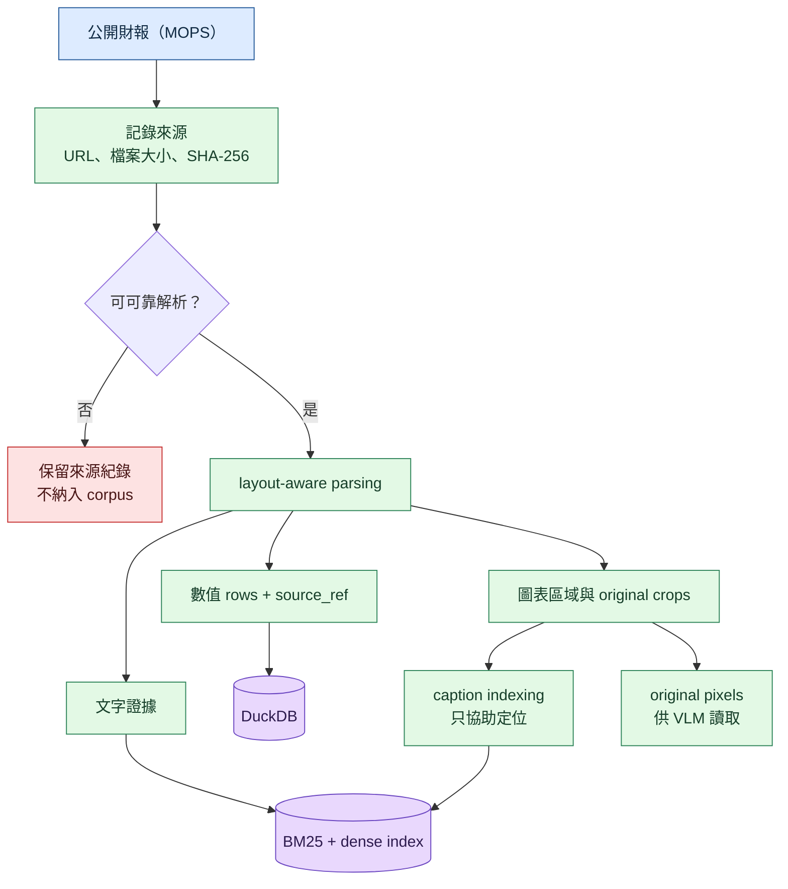
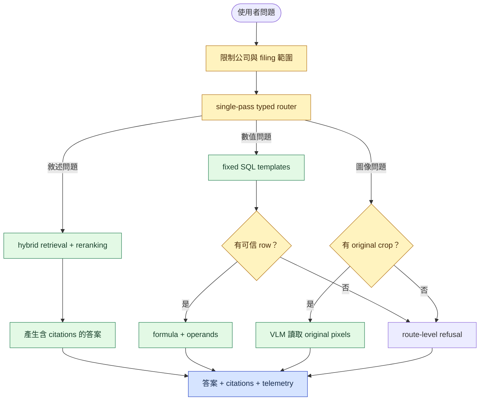

# TW Filing Intelligence

[](https://github.com/kuotunyu/tw-filing-intelligence/actions/workflows/ci.yml)
[](https://github.com/kuotunyu/tw-filing-intelligence/releases/latest)
[](https://www.python.org/)

> **最新 software release：v1.0.3。Frozen evaluation protocol：v1.0.0。**

這是一個臺灣公開財報 multimodal RAG / VLM 的事前註冊可行性研究：固定資料、模型、threshold 與評分規則後，加入更多檢索、數值與視覺能力，是否真的能勝過簡單的文字 RAG？

本專案是 **research prototype**，不是 production 系統、filing assistant 或投資建議。它的重點不是展示成功產品，而是保存一個可追溯、可重算的負結果。

## 先看懂這個研究

| 比較對象 | 做法 | LOCKED 答對題數 |
|---|---|---:|
| 簡單的文字檢索系統（F0） | PDF text、BM25、共用答案生成 | **17/33** |
| 完整候選系統（F7） | layout、hybrid retrieval、reranking、numeric route、visual evidence、typed routing | **6/33** |

完整候選系統不但沒有勝過 baseline，答對題數還從 17 題降到 6 題，因此依 frozen Protocol 1.0.0 判定 [`NO_GO`](docs/FEASIBILITY_REPORT.md)。F0 與 F7 是 protocol 中的實驗代號，不是產品版本。

## 為什麼是 NO-GO

- **數值回答失敗**：numeric route 處理的 12 題中，答對 **0 題**。
- **問題分流不可靠**：33 題中只有 **11 題**選對回答 route。
- **引用證據不足**：完整候選系統產生的 17 個 citations 中，只有 **9 個**有效。

LOCKED 只有 33 題，chart 題更只有 2 題。所有比例都必須連同 numerator、denominator 與信賴區間閱讀，不能視為 production capability estimate。

## 系統架構

### 財報如何變成可追溯證據

每份來源先記錄 URL、檔案大小與 SHA-256，再檢查 PDF 是否能可靠解析。可用文件拆成文字、數值與圖像證據；不可用文件只保留來源紀錄，不進入 corpus。



LOCKED numeric store 由 filing line streams 重建 FY2023–FY2024 rows。當時 TWSE OpenAPI snapshot 沒有期間重疊，XBRL 也沒有可用內容，因此兩者不是本次資料來源；每個數值 row 都保留 `source_kind` 與 `source_ref`。Caption 只協助定位 visual region，答案仍須讀取 original pixels。

### 完整候選系統如何回答

系統先限制公司與 filing，再以 deterministic rules 執行一次 typed routing。它不是循環規劃的 Agent；各 route 缺少可信證據時可以局部拒答。



## 評估如何保持公平

`DEV 設計 → 註冊 F0–F7 與 G1–G10 → 凍結 Protocol 與 artifact hashes → 唯一 LOCKED run → 保存 raw records → 離線重算 → NO_GO`

DEV 只能用於凍結前的設計；LOCKED 不能用來事後選 factor、threshold 或模型。CI 會從 committed raw records 重算 headline metrics、G1–G10 與 verdict。

## 實驗明細（供研究審查）

F0–F7 是事前註冊的 factor ladder，不是產品版本。F1–F6 是 diagnostic ablation；只有 F0 是 baseline、F7 是 preregistered full candidate。

| Factor | Locked accuracy | 逐步加入的能力 |
|---|---:|---|
| F0 | 51.5%（17/33） | 簡單文字 baseline |
| F1 | 45.5%（15/33） | 版面結構解析與 chunking |
| F2 | 42.4%（14/33） | hybrid retrieval |
| F3 | 57.6%（19/33） | cross-encoder reranking |
| F4 | 57.6%（19/33） | structured numeric route |
| F5 | 60.6%（20/33） | 圖表區域 caption indexing |
| F6 | 54.5%（18/33） | original crop evidence / crop VLM |
| F7 | 18.2%（6/33） | typed dispatch；preregistered full candidate |

F7 通過 G1、G8、G9、G10，但 G2–G7 均失敗。F5 的 20/33 是 failure-decomposition evidence，但仍只是 ablation；看到 LOCKED 後把 F5 改稱 candidate，會違反事前註冊。

No-evidence probes 全部拒答（5/5），但 LOCKED unanswerable questions 有 3/4 被過度回答。Gold set 部分由模型起草，最終 audit 也不是完全獨立或 blind；完整 composition、authorship 與 audit 狀態見 [final report](docs/FEASIBILITY_REPORT.md#gold-set-組成d-019-要求逐項印出)。

## 證據與重現

| 主張 | Committed evidence | Offline recomputation |
|---|---|---|
| Protocol 未漂移 | [`protocol_lock.json`](results/feasibility/protocol_lock.json) | `test_real_protocol_lock_still_holds` |
| 簡單系統（F0）17/33 | [`F0/records.jsonl`](results/runs/F0/records.jsonl) | `scripts/verify_results.py --dry-run` |
| 完整候選系統（F7）6/33 | [`F7/records.jsonl`](results/runs/F7/records.jsonl) | `scripts/verify_results.py --dry-run` |
| Citations 9/17、numeric 0/12、route 11/33 | [`F7/records.jsonl`](results/runs/F7/records.jsonl) | `scripts/verify_results.py --dry-run` |
| `NO_GO` | [`GO_NO_GO.json`](results/feasibility/GO_NO_GO.json) | `scripts/verify_evidence.py` |
| DEV / LOCKED 無 leakage | [`dev`](data/evaluation/dev/gold.jsonl)、[`locked`](data/evaluation/locked/gold.jsonl)、[`probes`](data/evaluation/locked/probes.jsonl) | `scripts/check_leakage.py` |

Python 3.13 與 [uv](https://docs.astral.sh/uv/) 的 clean-clone 驗證：

```bash
uv sync --extra dev --frozen
uv run pytest
uv run ruff check .
uv run ruff format --check .
uv run mypy src scripts
uv run python scripts/verify_results.py --dry-run
uv run python scripts/verify_evidence.py
uv run python scripts/check_leakage.py
```

上述重算全部離線、CPU-only，不呼叫模型、外部 API 或 GPU。唯一預期 skip 是未 commit 的 raw acquisition artifacts；manifest、LOCKED records 與結果仍會完整驗證。原始 filings 不在 repository 重新散布，來源與 SHA-256 見 [data provenance](docs/DATA_PROVENANCE.md)。

## 文件與使用範圍

- [Final report](docs/FEASIBILITY_REPORT.md) 與 [Protocol 1.0.0](docs/FEASIBILITY_PROTOCOL.md)：locked result、gates、limitations、factor ladder 與 thresholds。
- [Frozen errata](docs/ERRATA.md) 與 [Decision log](docs/DECISIONS.md)：不改 lock 的文字修正、研究決策與 failure history。
- [Data provenance](docs/DATA_PROVENANCE.md) 與 [Threat model](docs/THREAT_MODEL.md)：資料來源、排除、hashes 與安全邊界。
- [GitHub Releases](https://github.com/kuotunyu/tw-filing-intelligence/releases)：software publication history。

程式碼採 [MIT License](LICENSE)；TWSE、MOPS 與其他第三方資料不因此改變授權，詳見 [Third-Party Data and Use Notice](NOTICE.md)。研究結果不是投資建議，也不能作為 production filing assistant 的能力宣稱。
