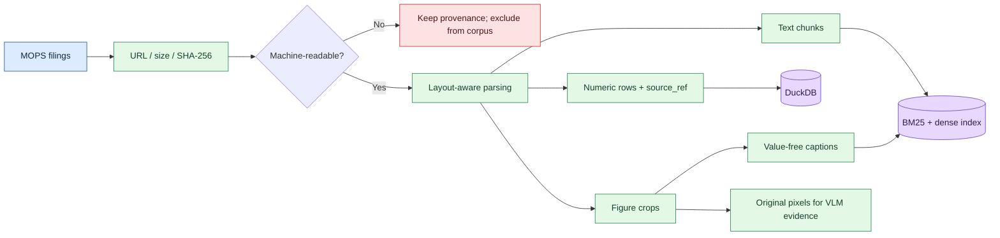
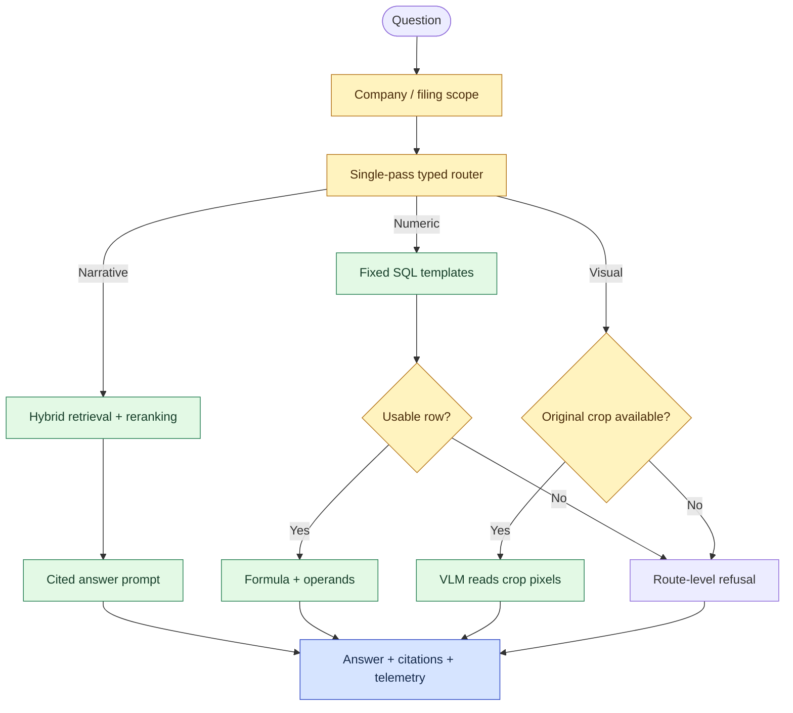
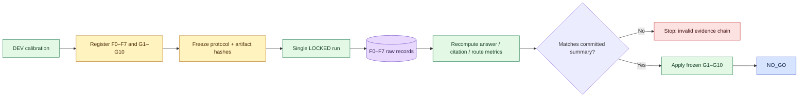

# TW Filing Intelligence

[](https://github.com/kuotunyu/tw-filing-intelligence/actions/workflows/ci.yml)
[](https://github.com/kuotunyu/tw-filing-intelligence/releases/latest)
[](https://www.python.org/)

> **Software / repository release: 1.0.3. Frozen evaluation protocol: 1.0.0.**

這是一個臺灣公開財報 multimodal RAG / VLM 的事前註冊可行性研究。研究問題是：在固定資料、模型、threshold 與評分規則後，加入版面解析、混合檢索、reranking、數值路徑與視覺證據，能否可靠地勝過簡單的文字 RAG baseline？

唯一 locked evaluation 的答案是 **不能**：baseline 答對 17/33，事前指定的完整候選系統答對 6/33，因此依 Protocol 1.0.0 判定 [`NO_GO`](docs/FEASIBILITY_REPORT.md)。這個 repository **不是 production 系統**、不是投資建議，也不提供 filing assistant 服務；它展示的是如何讓負結果仍可追溯、重算與審查。

## 結果先講

本研究把系統版本編為 F0–F7。F0（text-only baseline）是最小比較系統；F7（事前指定的完整候選系統）整合 layout-aware parsing、hybrid retrieval、reranking、structured numeric route、visual evidence 與 deterministic typed routing。F1–F6 是診斷性 ablation，用來觀察逐步加入元件的影響，不是可在看到 locked 結果後取代 F7 的候選產品。

| 項目 | 結果 |
|---|---:|
| F0：text-only baseline | 51.5%（17/33） |
| F7：preregistered full candidate | 18.2%（6/33） |
| 合併 hard set 差異 | -27.8pp |
| F7 citation validity | 52.9%（9/17） |
| F7 numeric route accuracy | 0%（0/12） |
| F7 route accuracy | 33.3%（11/33） |
| Frozen verdict | **NO_GO** |

研究涵蓋 10 份 FY2023–FY2024 filings，其中 8 份可機器使用；evaluation records 共 53 題：DEV 15、LOCKED 33、no-evidence probes 5。v1.0.3 clean clone 為 1,644 passed、1 個預期的 raw-acquisition skip、94.11% coverage。

LOCKED 只有 33 題，且 chart 題只有 2 題；所有比例都必須連同 denominator 與信賴區間閱讀，不能把這個小樣本當成 production capability estimate。

## 系統如何工作

### 1. Filing 變成可追溯證據

每份來源先記錄 URL、大小與 SHA-256，再進行 PDF 可讀性檢查。無法可靠解析的文件保留 acquisition provenance，但不進入檢索；可用文件拆成文字 chunks、數值 rows 與 figure crops。



本次 locked numeric store 使用 filing line stream 重建 FY2023–FY2024 rows；當時 TWSE OpenAPI snapshot 沒有期間重疊，XBRL 也沒有可用內容，因此兩者沒有被包裝成實際資料來源。每一列都保留 `source_kind` 與 `source_ref`。Caption 只用於找出 visual region，數值答案仍必須讀取 original crop pixels。

### 2. F7 如何回答問題

F7 先限制公司與文件，再以 deterministic rules 做一次 typed dispatch。它不是循環規劃的 Agent：narrative、numeric 與 visual route 各自產生答案，缺少可用證據時可以局部拒答。



### 3. Frozen evaluation 如何得到 NO-GO

DEV 只能用於事前選擇設計。Protocol freeze 後，threshold、model pins、tolerance、gold hashes 與 gates 都鎖定，再執行唯一一次 LOCKED evaluation；CI 從 committed raw records 重算 summary、G1–G10 與 verdict。



## 事前註冊結果

| Factor | Locked accuracy | 加入的主要因素 |
|---|---:|---|
| F0 | 51.5%（17/33） | text-only baseline |
| F1 | 45.5%（15/33） | layout-aware parsing |
| F2 | 42.4%（14/33） | hybrid retrieval |
| F3 | 57.6%（19/33） | cross-encoder reranking |
| F4 | 57.6%（19/33） | structured numeric route |
| F5 | 60.6%（20/33） | visual-region caption indexing |
| F6 | 54.5%（18/33） | original crop evidence / crop VLM |
| F7 | 18.2%（6/33） | **preregistered full candidate：typed dispatch** |

F7 通過 G1、G8、G9、G10，但 G2–G7 均失敗，所以 frozen verdict 是 `NO_GO`。F5 的 20/33 是重要的 failure-decomposition evidence，但它只是 ablation rung；看到 locked 結果後把 F5 改稱 candidate，會違反事前註冊。

主要 failure signals：

- citation validity：52.9%（9/17）
- numeric route accuracy：0%（0/12）
- route accuracy：33.3%（11/33）
- no-evidence probes refused：100%（5/5），但 locked unanswerable over-answer rate 為 75%（3/4）

Gold construction 部分使用模型起草，最後 audit 也不是完全獨立或 blind；composition、authorship 與 audit 狀態已公開於 [final report](docs/FEASIBILITY_REPORT.md#gold-set-組成d-019-要求逐項印出)。這些限制不會因 repository 整理而被隱藏。

## 證據與重現

| Claim | Committed evidence | Offline recomputation |
|---|---|---|
| Protocol 未漂移 | [`protocol_lock.json`](results/feasibility/protocol_lock.json) | `test_real_protocol_lock_still_holds` |
| F0 17/33 | [`F0/records.jsonl`](results/runs/F0/records.jsonl) | `scripts/verify_results.py --dry-run` |
| F7 6/33 | [`F7/records.jsonl`](results/runs/F7/records.jsonl) | `scripts/verify_results.py --dry-run` |
| Citation 9/17、numeric 0/12、route 11/33 | [`F7/records.jsonl`](results/runs/F7/records.jsonl) | `scripts/verify_results.py --dry-run` |
| `NO_GO` | [`GO_NO_GO.json`](results/feasibility/GO_NO_GO.json) | `scripts/verify_evidence.py` |
| DEV / LOCKED 無 leakage | [`dev`](data/evaluation/dev/gold.jsonl)、[`locked`](data/evaluation/locked/gold.jsonl)、[`probes`](data/evaluation/locked/probes.jsonl) | `scripts/check_leakage.py` |

Python 3.13 與 [uv](https://docs.astral.sh/uv/) 的 clean-clone 驗證：

```bash
uv sync --extra dev --frozen
uv run pytest
uv run ruff check .
uv run ruff format --check .
uv run mypy src scripts
uv run python scripts/verify_results.py --dry-run
uv run python scripts/verify_evidence.py
uv run python scripts/check_leakage.py
```

上述 evidence recomputation 全部離線、CPU-only，不呼叫模型、外部 API 或 GPU。唯一預期 skip 是 raw acquisition artifacts 刻意不 commit；committed manifest、locked records 與結果仍會完整驗證。原始 filings 不在 repository 重新散布，來源與 SHA-256 請見 [data provenance](docs/DATA_PROVENANCE.md)。

## 文件與使用範圍

| 文件 | 用途 |
|---|---|
| [Final report](docs/FEASIBILITY_REPORT.md) | Locked result、gates、limitations 與 `NO_GO` |
| [Protocol 1.0.0](docs/FEASIBILITY_PROTOCOL.md) | Frozen design、factor ladder 與 thresholds |
| [Frozen errata](docs/ERRATA.md) | 不改 lock 的 frozen-prose corrections |
| [Decision log](docs/DECISIONS.md) | 研究決策與 failure history |
| [Data provenance](docs/DATA_PROVENANCE.md) | 來源、acquisition、排除與 hashes |
| [Threat model](docs/THREAT_MODEL.md) | Injection、SSRF、rate limit、leakage、secrets |
| [GitHub Releases](https://github.com/kuotunyu/tw-filing-intelligence/releases) | Software publication history |

程式碼採 [MIT License](LICENSE)；TWSE、MOPS 與其他第三方資料不因此改變授權，詳見 [Third-Party Data and Use Notice](NOTICE.md)。研究結果不是投資建議，也不能作為 production filing assistant 的能力宣稱。
