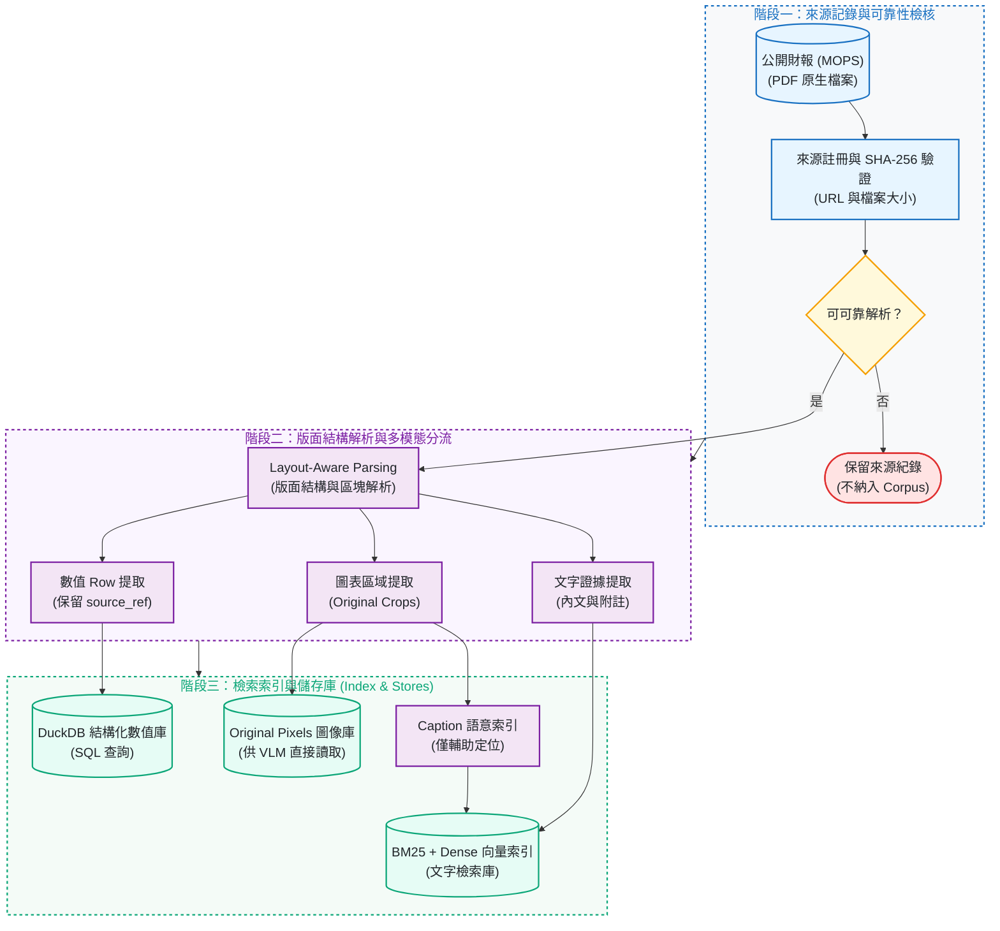
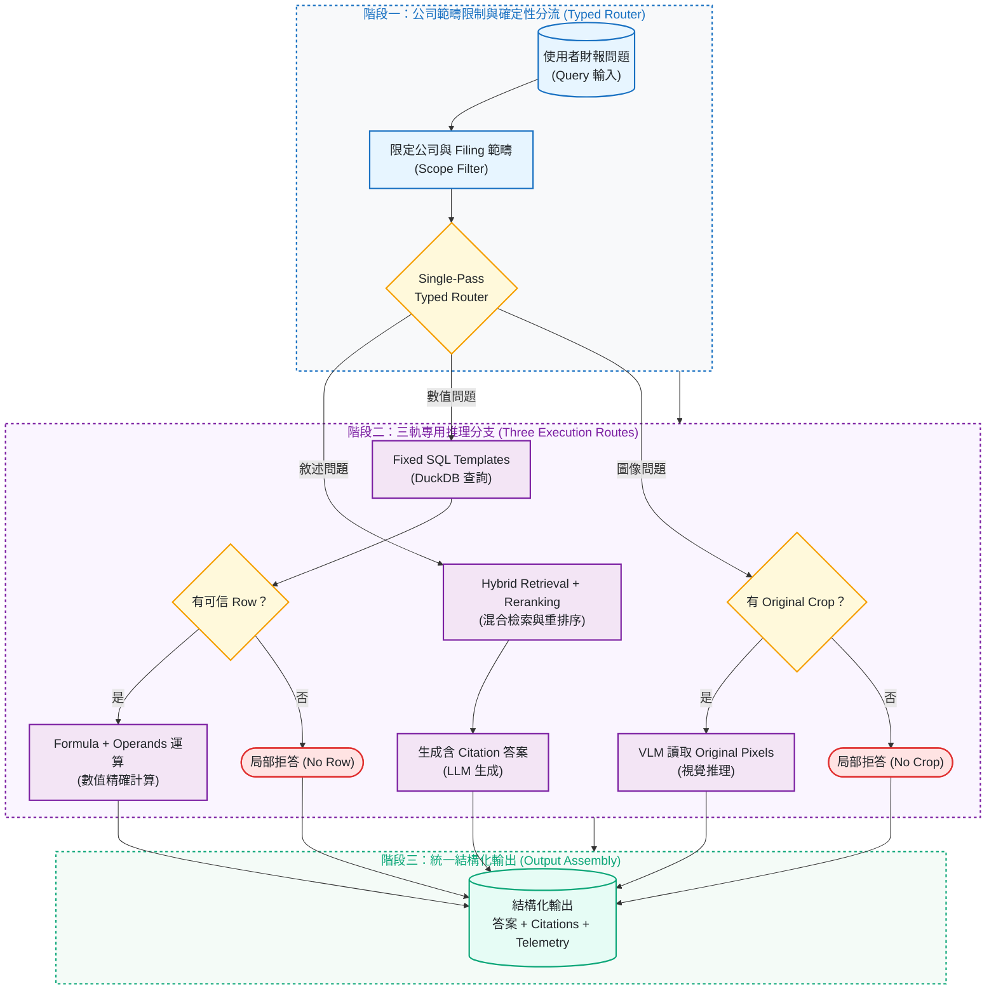

# TW Filing Intelligence

[](https://github.com/kuotunyu/tw-filing-intelligence/actions/workflows/ci.yml)
[](https://github.com/kuotunyu/tw-filing-intelligence/releases/latest)


[](LICENSE)

> **最新 Software Release：v1.0.3 · 凍結評測協定 (Frozen Protocol)：v1.0.0**

這是一個臺灣公開財報 multimodal RAG / VLM 的事前註冊可行性研究 (Preregistered Feasibility Study)：固定資料、模型、threshold 與評分規則後，加入更多檢索、數值與視覺能力，是否真的能勝過簡單的文字 RAG？

本專案是 **research prototype**，**不是 production 系統**、filing assistant，也**不是投資建議**。它的重點不是展示成功產品，而是保存一個可追溯、可重算的客觀負結果 (Negative Result)。

---

## 核心結論與研究摘要

| 比較對象 | 系統實作架構 | LOCKED 評測答對題數 |
|---|---|---:|
| 簡單文字檢索系統 (F0) | PDF 文字提取、BM25 檢索、共用答案生成 | **17 / 33** (51.5%) |
| 完整候選系統 (F7) | Layout 解析、混合檢索、Reranker、數值路由、視覺證據、Typed Routing | **6 / 33** (18.2%) |

完整候選系統並未超越基準線，答對題數反而由 17 題降至 6 題。依據預先凍結之 Protocol 1.0.0 規範，正式判定為 [`NO_GO`](docs/FEASIBILITY_REPORT.md)。（註：F0 與 F7 為協定中之實驗代號，非產品版本號）。

### 為什麼判定為 NO-GO？

1. **數值推理失效**：由 Numeric Route 處理之 12 題數值問題中，最終答對 **0 題**。
2. **問題分流不可靠**：33 題測試中僅 **11 題**正確選中最佳處理分支 (Route)。
3. **證據引用不足**：完整系統產出之 17 個條文引用 (Citations) 中，僅 **9 個**具備有效佐證力。

---

## 系統架構與 Pipeline

### 1. 財報解析與多模態證據鏈建置

每份財報來源先記錄官方 URL、檔案大小與 SHA-256 簽章，經可靠性檢核後拆解為文字、結構化數值與原始圖表像素：



### 2. 完整候選系統推論與分流架構 (F7 Typed Routing)

系統先限制公司與 Filing 範疇，再以確定性規則 (Deterministic Rules) 執行單次 Typed Routing 分流：



---

## 嚴謹評測設計與消融實驗明細

```text
DEV 設計 ➔ 預先註冊 F0–F7 與 G1–G10 門檻 ➔ 凍結 Protocol 與 Artifact 哈希 ➔ 唯一 LOCKED Run ➔ 離線重算 ➔ 判定 NO_GO
```

F0–F7 為事前註冊之能力階梯 (Factor Ladder)，F1–F6 為診斷消融組別，F0 為基準線，F7 為事前註冊之完整候選系統：

| 實驗 Factor | Locked 評測準確率 | 逐步加入之技術能力 |
|---|---:|---|
| F0 (Baseline) | 51.5% (17 / 33) | 簡單文字基準線 (PDF Text + BM25) |
| F1 | 45.5% (15 / 33) | 版面結構解析與區塊切分 (Layout Chunking) |
| F2 | 42.4% (14 / 33) | 雙軌混合檢索 (Hybrid Retrieval) |
| F3 | 57.6% (19 / 33) | Cross-Encoder 重排序 (Reranker) |
| F4 | 57.6% (19 / 33) | 結構化數值管線 (DuckDB SQL Route) |
| F5 | 60.6% (20 / 33) | 圖表區域 Caption 語意索引 |
| F6 | 54.5% (18 / 33) | 原始區域裁切與 VLM 讀取 (Crop VLM) |
| F7 (Full Candidate) | 18.2% (6 / 33) | 確定性分流 (Typed Dispatch) 完整系統 |

---

## 證據可追溯性與完全離線重現

| 核心主張 | 凍結之審查證據 (Committed Evidence) | 離線驗證方式 |
|---|---|---|
| Protocol 未漂移 | [`protocol_lock.json`](results/feasibility/protocol_lock.json) | `test_real_protocol_lock_still_holds` |
| 簡單系統 (F0) 17/33 | [`F0/records.jsonl`](results/runs/F0/records.jsonl) | `scripts/verify_results.py --dry-run` |
| 完整系統 (F7) 6/33 | [`F7/records.jsonl`](results/runs/F7/records.jsonl) | `scripts/verify_results.py --dry-run` |
| 判定 NO_GO | [`GO_NO_GO.json`](results/feasibility/GO_NO_GO.json) | `scripts/verify_evidence.py` |
| DEV / LOCKED 無洩漏 | [`dev`](data/evaluation/dev/gold.jsonl) 與 [`locked`](data/evaluation/locked/gold.jsonl) | `scripts/check_leakage.py` |

### 快速開始與離線驗證

環境需求：Python 3.13、`uv`（完全離線執行，無需 GPU 或 API Key）：

```bash
# 建立環境並安裝相依套件
uv sync --extra dev --frozen

# 執行測試與靜態稽核
uv run pytest
uv run ruff check .
uv run ruff format --check .
uv run mypy src scripts

# 執行結果驗證與資料洩漏檢查
uv run python scripts/verify_results.py --dry-run
uv run python scripts/verify_evidence.py
uv run python scripts/check_leakage.py
```

---

## 核心文檔導覽

- [Feasibility Final Report](docs/FEASIBILITY_REPORT.md)：完整 Locked 結果、G1–G10 門檻通過狀態與限制。
- [Protocol 1.0.0](docs/FEASIBILITY_PROTOCOL.md)：事前註冊之實驗協定與凍結規範。
- [Data Provenance](docs/DATA_PROVENANCE.md)：公開財報來源、SHA-256 雜湊與排除清單。
- [Decision Log](docs/DECISIONS.md)：研究決策脈絡與歷史紀錄。

---

## 授權與聲明

本專案之原始程式碼採 [MIT License](LICENSE)。公開財報內容與資料來源請遵循臺灣證券交易所 (TWSE) 與公開資訊觀測站 (MOPS) 之規範。
