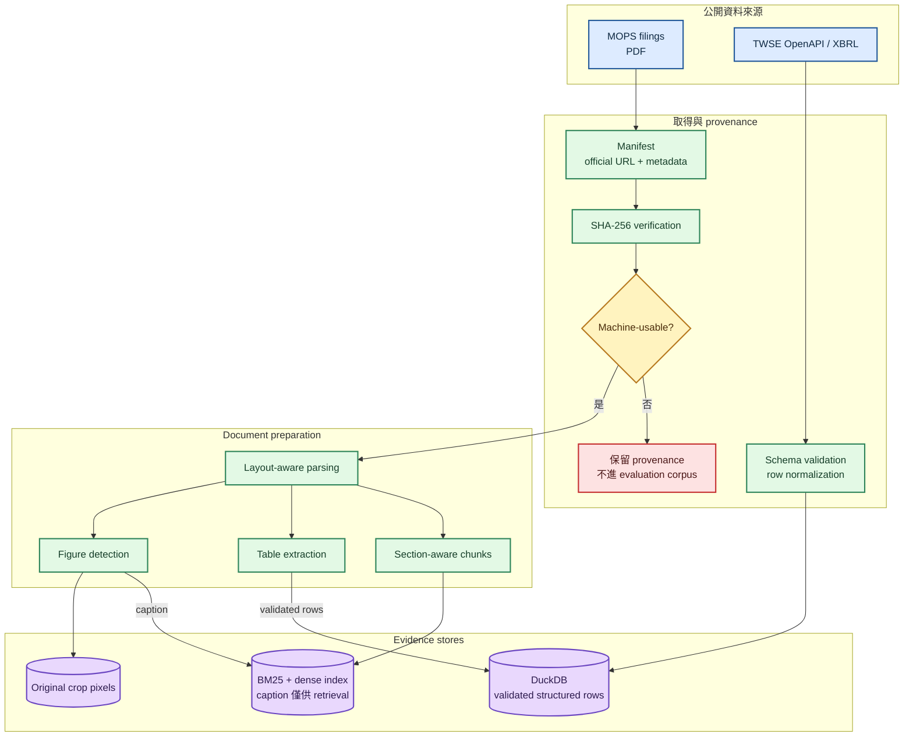
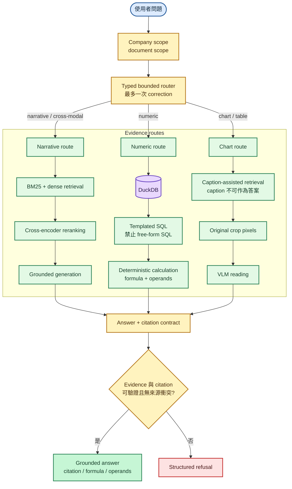
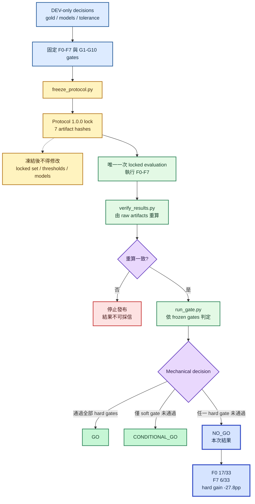

# README Mermaid 圖表 Implementation Plan

> **For agentic workers:** REQUIRED SUB-SKILL: Use superpowers:subagent-driven-development (recommended) or superpowers:executing-plans to implement this plan task-by-task. Steps use checkbox (`- [ ]`) syntax for tracking.

**Goal:** 在 README 加入三張經實際 render 驗證的 Mermaid 圖，清楚說明 offline data preparation、query-time routes 與 pre-registered evaluation。

**Architecture:** 每張圖只處理一個視角，使用 GitHub 原生 `flowchart` 與一致的高對比樣式。README 直接保存 Mermaid source，不提交衍生 PNG / SVG；系統行為與數字只取自現有 code、Protocol 1.0.0 與 frozen results。

**Tech Stack:** GitHub Flavored Markdown、Mermaid flowchart、Mermaid CLI、PowerShell、pytest、Ruff、mypy

## Global Constraints

- README 以正體中文為主，technical terms 保留原文。
- README 與 Mermaid labels 不使用 emoji 或裝飾性 Unicode symbols。
- 必須保留「不是投資建議」與「不是 production 系統」。
- 不修改 `docs/FEASIBILITY_PROTOCOL.md`、locked data 或 `results/feasibility/`。
- `NO_GO` 是有效研究結論，不得畫成 pipeline error。
- Commit 作者只能是 `kuotunyu <61350295+kuotunyu@users.noreply.github.com>`，不得加入 `Co-authored-by:`。
- 不提交 `.mmd`、PNG 或 SVG；Mermaid 驗證產物只放暫存目錄並在驗證後移除。

---

### Task 1: 產生並驗證三張 Mermaid 圖

**Files:**
- Create temporarily: `.tmp-mermaid/offline-preparation.mmd`
- Create temporarily: `.tmp-mermaid/query-flow.mmd`
- Create temporarily: `.tmp-mermaid/evaluation-flow.mmd`
- Do not commit: `.tmp-mermaid/`

**Interfaces:**
- Consumes: `docs/superpowers/specs/2026-08-03-readme-mermaid-diagrams-design.md`、`src/twfi/`、`docs/FEASIBILITY_PROTOCOL.md`、`results/feasibility/summary.json`
- Produces: 三段通過 Mermaid CLI render 的 source code，供 Task 2 原樣嵌入 README

- [ ] **Step 1: 建立 offline data preparation 圖**



- [ ] **Step 2: 建立 query-time answer flow 圖**



- [ ] **Step 3: 建立 pre-registered evaluation 圖**



- [ ] **Step 4: 用 Mermaid CLI render 三張圖**

Run:

```powershell
mmdc -i .tmp-mermaid/offline-preparation.mmd -o $env:TEMP/twfi-offline.svg -b transparent
mmdc -i .tmp-mermaid/query-flow.mmd -o $env:TEMP/twfi-query.svg -b transparent
mmdc -i .tmp-mermaid/evaluation-flow.mmd -o $env:TEMP/twfi-evaluation.svg -b transparent
Get-Item $env:TEMP/twfi-offline.svg, $env:TEMP/twfi-query.svg, $env:TEMP/twfi-evaluation.svg | Select-Object Name,Length
```

Expected: 三個 `mmdc` command 均 exit 0，三個 SVG 的 `Length` 均大於 0。

---

### Task 2: 將已驗證圖表整合進 README

**Files:**
- Modify: `README.md`

**Interfaces:**
- Consumes: Task 1 三段已通過 render 的 Mermaid source
- Produces: GitHub 可直接渲染、正體中文主體且無 emoji 的 README

- [ ] **Step 1: 取代現有 ASCII 系統框架**

在 `## 系統設計` 下依序加入小標題 `### Offline data preparation` 與 `### Query-time answer flow`，嵌入 Task 1 的前兩段 Mermaid source。保留五條 route 說明，但刪除原本的 `text` code block。

- [ ] **Step 2: 加入研究流程圖**

在 `## 事前註冊實驗` 的說明文字後、F0–F7 table 前加入 `### Pre-registered evaluation`，嵌入 Task 1 的第三段 Mermaid source。

- [ ] **Step 3: 檢查 README invariants**

Run:

```powershell
rg -n "不是投資建議|不是 production 系統|NO_GO|F0 17/33|F7 6/33|-27.8pp" README.md
rg -n -P "[\x{1F300}-\x{1FAFF}\x{2600}-\x{27BF}⑤]" README.md
```

Expected: 第一個 command 找到所有必要文字；第二個 command exit 1 且沒有輸出，代表無 emoji。

- [ ] **Step 4: 從完成版 README 再次驗證 Mermaid**

Run:

```powershell
python C:/Users/3Hml/.agents/skills/design-doc-mermaid/scripts/extract_mermaid.py README.md --validate
```

Expected: 找到三張 Mermaid 圖且三張 validation 全部通過。

---

### Task 3: Repository 品質驗證、提交與推送

**Files:**
- Modify: `README.md`
- Preserve untracked/ignored: `interview.md`

**Interfaces:**
- Consumes: 完成版 README
- Produces: 通過 local checks 與 GitHub Actions 的 `main`

- [ ] **Step 1: 執行完整本機驗證**

Run:

```powershell
.venv/Scripts/python.exe -m pytest
.venv/Scripts/python.exe -m ruff check .
.venv/Scripts/python.exe -m ruff format --check .
.venv/Scripts/python.exe -m mypy src
git diff --check
git check-ignore -v interview.md
```

Expected: pytest 0 failures、Ruff / format / mypy exit 0、`git diff --check` 無輸出、`interview.md` 由 `.git/info/exclude` 排除。

- [ ] **Step 2: 確認提交範圍與作者**

Run:

```powershell
git status --short
git diff --stat
git config user.name
git config user.email
```

Expected: 只包含 plan 與 README 文件變更；作者為 `kuotunyu` 與 GitHub noreply email，沒有 PDF、`.env`、rendered images 或 `interview.md`。

- [ ] **Step 3: 提交 README 實作**

```powershell
git add -- README.md
git commit -m "加入 Mermaid 架構與研究流程圖"
```

- [ ] **Step 4: 推送 main 並等待 CI**

```powershell
git push origin main
$runId = gh run list --workflow ci.yml --limit 1 --json databaseId --jq '.[0].databaseId'
gh run watch $runId --exit-status --interval 5
```

Expected: push 成功；最新 CI conclusion 為 `success`。

- [ ] **Step 5: GitHub 端最終稽核**

Run:

```powershell
git ls-remote --heads origin
gh api repos/kuotunyu/tw-filing-intelligence/contributors --paginate --jq '.[].login'
gh api repos/kuotunyu/tw-filing-intelligence/contents/README.md --jq '.sha'
git status --short --branch
```

Expected: 遠端只有 `main`；Contributors 只有 `kuotunyu`；README SHA 對應目前 `main`；工作區乾淨並追蹤 `origin/main`。
