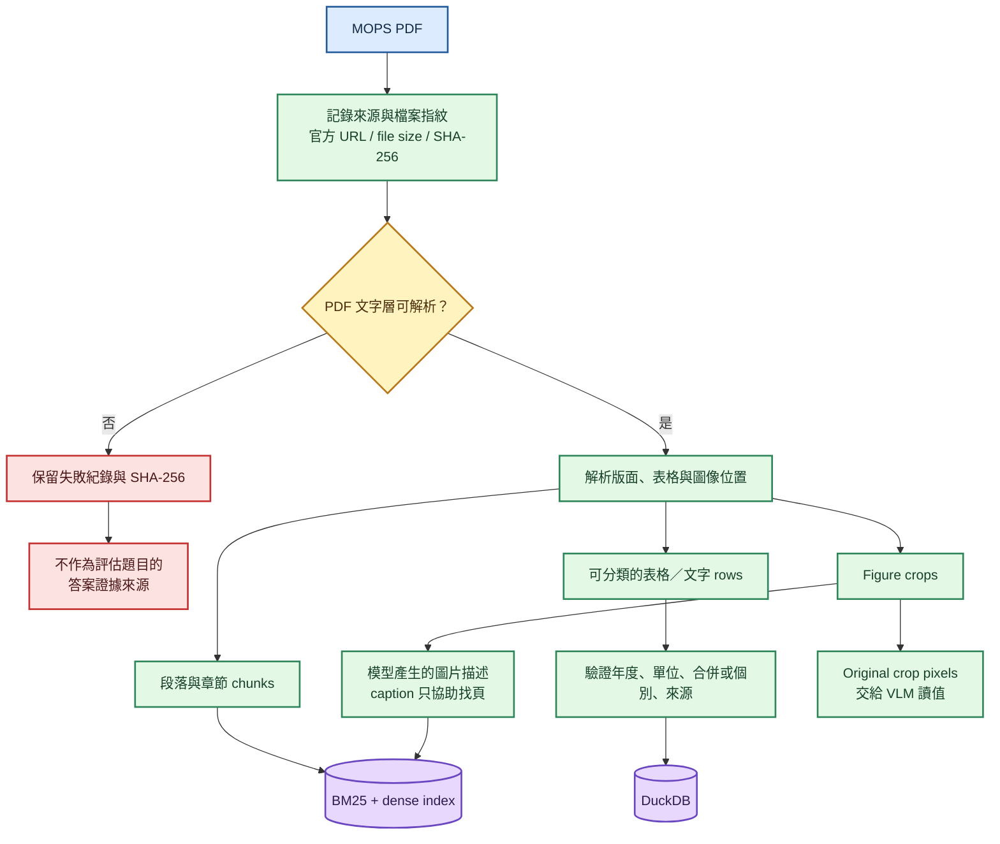
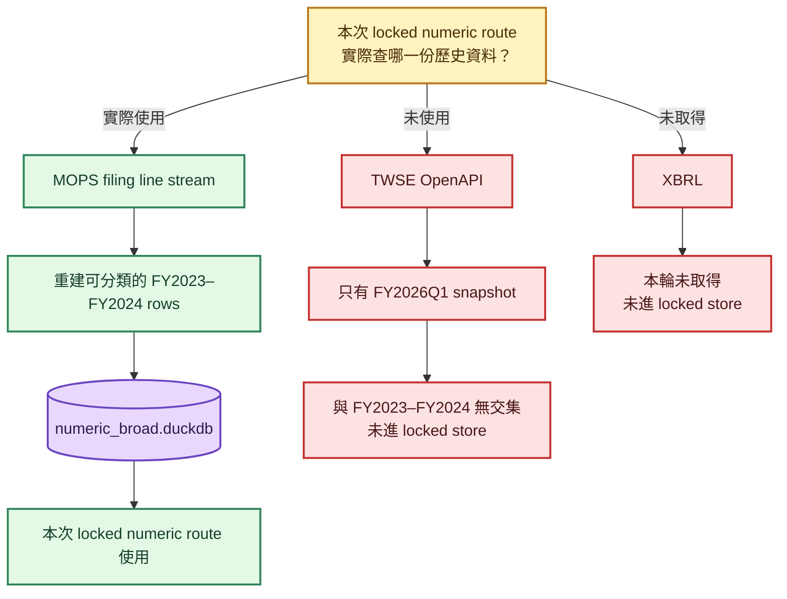
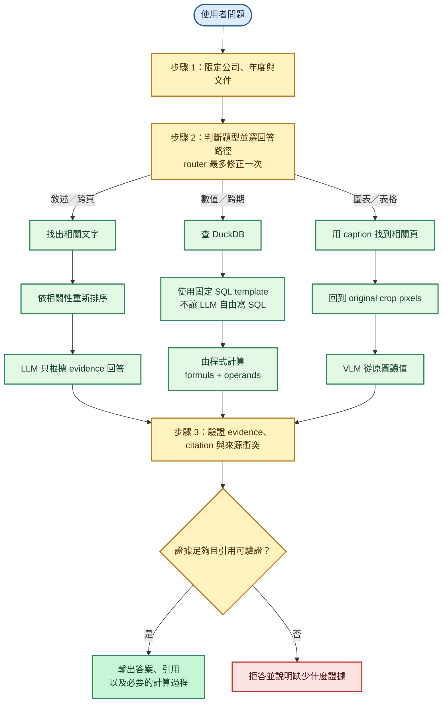
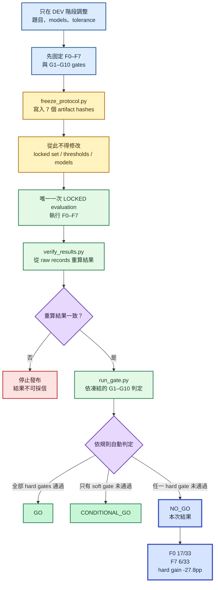

# README Mermaid 清楚度修正 Implementation Plan

`status: executed and archived — 2026-08-03`

> 四張 Mermaid 已完成、render／目視檢查通過，並隨 v1.0.1 closeout 進入 `main`。
> 本檔保留實作證據，不再是待執行工作。

> **For agentic workers:** REQUIRED SUB-SKILL: Use superpowers:subagent-driven-development (recommended) or superpowers:executing-plans to implement this plan task-by-task. Steps use checkbox (`- [ ]`) syntax for tracking.

**Goal:** 將容易混淆的 Mermaid 資料準備圖重構成四張不需猜測來源、箭頭或術語的圖，並修正 locked numeric store 的實際資料來源。

**Architecture:** PDF evidence preparation 與 numeric source reality 分開；query flow 與 evaluation flow 改成白話中文動作句。每張圖前先說明它回答的問題，Mermaid source 直接放在 README，不提交衍生圖檔。

**Tech Stack:** GitHub Flavored Markdown、Mermaid 11 flowchart、Mermaid CLI、PowerShell、pytest、Ruff、mypy

## Global Constraints

- README 以正體中文為主，technical terms 保留原文但同段解釋用途。
- README 與 Mermaid labels 不使用 emoji 或裝飾性 Unicode symbols。
- 必須保留「不是投資建議」與「不是 production 系統」。
- 不修改 frozen protocol、locked data 或 `results/feasibility/`。
- 不得暗示 OpenAPI / XBRL 提供本次 FY2023–FY2024 locked numeric store。
- `NO_GO` 是有效研究結論，不畫成 pipeline error。
- Commit 作者只能是 `kuotunyu <61350295+kuotunyu@users.noreply.github.com>`，不得加入 `Co-authored-by:`。
- 不提交暫存 `.mmd`、PNG 或 SVG。

---

### Task 1: 建立並驗證四張修正版 Mermaid 圖

**Files:**
- Create temporarily: `.tmp-mermaid/pdf-evidence.mmd`
- Create temporarily: `.tmp-mermaid/numeric-sources.mmd`
- Create temporarily: `.tmp-mermaid/query-flow.mmd`
- Create temporarily: `.tmp-mermaid/evaluation-flow.mmd`
- Do not commit: `.tmp-mermaid/`

**Interfaces:**
- Consumes: `docs/FEASIBILITY_REPORT.md:126`、`docs/FEASIBILITY_REPORT.md:130`、`scripts/run_eval.py`、`src/twfi/`
- Produces: 四段通過 Mermaid CLI render 且經視覺檢查的 source code

- [x] **Step 1: 建立 PDF evidence preparation 圖**



- [x] **Step 2: 建立 locked numeric source reality 圖**



- [x] **Step 3: 建立白話 query flow 圖**



- [x] **Step 4: 建立白話 evaluation flow 圖**



- [x] **Step 5: 用 Mermaid CLI render 並目視檢查四張圖**

Run:

```powershell
npx --yes @mermaid-js/mermaid-cli -i .tmp-mermaid/pdf-evidence.mmd -o "$env:TEMP/twfi-pdf-evidence.png" -b white -w 1800
npx --yes @mermaid-js/mermaid-cli -i .tmp-mermaid/numeric-sources.mmd -o "$env:TEMP/twfi-numeric-sources.png" -b white -w 1800
npx --yes @mermaid-js/mermaid-cli -i .tmp-mermaid/query-flow.mmd -o "$env:TEMP/twfi-query-flow.png" -b white -w 1800
npx --yes @mermaid-js/mermaid-cli -i .tmp-mermaid/evaluation-flow.mmd -o "$env:TEMP/twfi-evaluation-flow.png" -b white -w 1800
Get-Item "$env:TEMP/twfi-pdf-evidence.png","$env:TEMP/twfi-numeric-sources.png","$env:TEMP/twfi-query-flow.png","$env:TEMP/twfi-evaluation-flow.png" | Select-Object Name,Length
```

Expected: 四個 render command 都 exit 0；四個 PNG 非空；目視確認來源與去向不需跨線推測。

---

### Task 2: 將四張圖與白話導讀整合進 README

**Files:**
- Modify: `README.md`

**Interfaces:**
- Consumes: Task 1 四段已驗證 Mermaid source
- Produces: 正體中文主體、無 emoji、資料來源準確的 GitHub README

- [x] **Step 1: 重寫系統設計的資料準備段落**

將 `### Offline data preparation` 改為 `### PDF 如何變成可查詢證據`，在圖前加入：

```markdown
這張圖只回答一件事：一份 PDF 進入專案後，哪些內容會進 search index、DuckDB 或 VLM。
```

以 Task 1 Step 1 的圖取代原圖。

- [x] **Step 2: 加入 numeric source reality**

新增 `### 本次實驗的歷史數值來自哪裡`，在圖前加入：

```markdown
本次 locked run 沒有用 OpenAPI 或 XBRL 補齊 FY2023–FY2024 歷史數值；numeric route 查的是專案從 filing line stream 重建的 rows。
```

圖後加入：

```markdown
因此本輪只能稱為「已驗證結構化資料」，不能稱為「官方結構化歷史資料」。每筆 row 仍保留 `source_kind` 與 `source_ref`，可追回原始文件位置。
```

- [x] **Step 3: 重寫 query flow 與導讀**

將標題改為 `### 問題如何選路徑並產生答案`，圖前加入：

```markdown
問題先限制到指定公司、年度與文件，再依題型選回答路徑；不論走哪條路，最後都必須通過證據與引用驗證，否則拒答。
```

以 Task 1 Step 3 的圖取代現圖。

- [x] **Step 4: 重寫 evaluation flow 與導讀**

將標題改為 `### 事前註冊如何防止看到結果後再調整`，圖前加入：

```markdown
只有 DEV 階段可以調整設定；protocol freeze 之後，只能執行 locked evaluation、從 raw records 重算，並依事先固定的 gates 判定。
```

以 Task 1 Step 4 的圖取代現圖。

- [x] **Step 5: 檢查讀者不需猜測的文案 invariants**

Run:

```powershell
rg -n "這張圖只回答一件事|沒有用 OpenAPI 或 XBRL|只有 FY2026Q1|XBRL.*未取得|已驗證結構化資料|問題先限制到指定公司|只有 DEV 階段可以調整" README.md
rg -n "Machine-usable|Document preparation|Company scope|Mechanical decision|Offline data preparation|Query-time answer flow|Pre-registered evaluation" README.md
```

Expected: 第一個 command 找到所有明確說明；第二個 command exit 1 且沒有輸出。

---

### Task 3: 完整驗證、提交與推送

**Files:**
- Modify: `README.md`
- Preserve ignored: `interview.md`

**Interfaces:**
- Consumes: 完成版 README
- Produces: 通過本機 checks 與 GitHub Actions 的 `main`

- [x] **Step 1: 從完成版 README 抽出四張 Mermaid 並重新 render**

Run:

```powershell
$env:PYTHONIOENCODING='utf-8'
.venv/Scripts/python.exe <DESIGN_DOC_MERMAID_SKILL_ROOT>/scripts/extract_mermaid.py README.md --output-dir .tmp-mermaid/extracted --prefix readme
$outputs = @()
Get-ChildItem .tmp-mermaid/extracted -Filter *.mmd | Sort-Object Name | ForEach-Object {
    $output = Join-Path $env:TEMP ("twfi-" + $_.BaseName + ".svg")
    npx --yes @mermaid-js/mermaid-cli -i $_.FullName -o $output -b transparent
    if ($LASTEXITCODE -ne 0) { exit $LASTEXITCODE }
    $outputs += Get-Item $output
}
$outputs | Select-Object Name,Length
if ($outputs.Count -ne 4 -or ($outputs | Where-Object Length -le 0)) { exit 1 }
```

Expected: extractor 找到四張圖；四張皆 exit 0 且輸出非空。

- [x] **Step 2: 執行 README 與 repository checks**

Run:

```powershell
rg -n "不是投資建議|不是 production 系統|NO_GO|F0 17/33|F7 6/33|-27.8pp" README.md
rg -n -P "[\x{1F300}-\x{1FAFF}\x{2600}-\x{27BF}⑤]" README.md
.venv/Scripts/python.exe -m pytest
.venv/Scripts/python.exe -m ruff check .
.venv/Scripts/python.exe -m ruff format --check .
.venv/Scripts/python.exe -m mypy src
git diff --check
git check-ignore -v interview.md
```

Expected: README 必要文字存在、emoji scan exit 1、pytest 0 failures、Ruff / format / mypy exit 0、`git diff --check` 無輸出、`interview.md` 仍被排除。

- [x] **Step 3: 提交並推送**

```powershell
git add -- README.md docs/superpowers/plans/2026-08-03-readme-mermaid-diagrams.md
git commit -m "釐清 Mermaid 架構圖"
git push origin main
```

- [x] **Step 4: 等待 CI 並稽核 GitHub**

Run:

```powershell
$runId = gh run list --workflow ci.yml --limit 1 --json databaseId --jq '.[0].databaseId'
gh run watch $runId --exit-status --interval 5
git ls-remote --heads origin
gh api repos/kuotunyu/tw-filing-intelligence/contributors --paginate --jq '.[].login'
git status --short --branch
```

Expected: CI `success`、遠端只有 `main`、Contributors 只有 `kuotunyu`、工作區乾淨。
